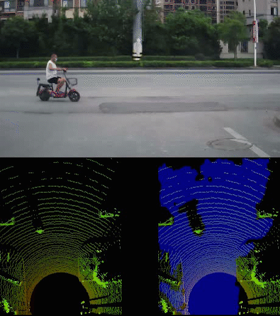

# BEV-RoadSeg

## Introduction
This is a repository based on `SNE-Roadseg`, including` Python onnx and tensorRT API` versions. For source code and papers, see: https://github.com/hlwang1124/SNE-RoadSeg.

In this repo, we provide the training and testing setup for the `Ouster-OS1-128 Lidar Road Dataset`.

<p align="center">

</p>


## Setup
Please setup the Road Dataset and pretrained weights according to the following folder structure:
```
BEV-RoadSeg
 |-- checkpoints
 |  |-- kitti
 |  |  |-- kitti_net_RoadSeg.pth
 |-- data
 |-- datasets
 |  |-- kitti
 |  |  |-- training
 |  |  |  |-- gt_image_2
 |  |  |  |-- image_2
 |  |  |-- validation
 |  |  |  |-- gt_image_2
 |  |  |  |-- image_2
 |  |  |-- testing
 |  |  |  |-- depth_u16
 |  |  |  |-- image_2
 |  |  |-- image_cam #Creates datas for merge_cam_to_bev
 |  |  |-- velodyne #Creates dataset for bev
 ...
```
## Usage

### Data preparation
For `.pkl` Lidar Dataset, you need to setup `datasets/kitti/velodyne`folder as mentioned above.
```
python3 lidar_pkl_to_bev.py
```
and you will get the `img_bev` and `img_cam` results in `datasets/kitti/velodyne`. The segmentation annotation is not provided, hence we need to label drivable aera from img_bev.


### Testing for KITTI submission
You need to setup the `checkpoints` and the `datasets/kitti/testing` folder as mentioned above. Then, run the following script:
```
bash ./scripts/test.sh
```
and you will get the prediction results in `testresults`.

### Detect for KITTI submission
You need to setup the `checkpoints` and the `datasets/kitti/testing` folder as mentioned above. Then, run the following script:
```
bash ./scripts/detect.sh
```
and you will get the video or img results in `testresults`, `merge img_cam with img_bev`.

### Training on the KITTI dataset
For training, you need to setup the `datasets/kitti` folder as mentioned above. You can split the original training set into a new training set and a validation set as you like. Then, run the following script:
```
bash ./scripts/train.sh
```
and the weights will be saved in `checkpoints` and the `tensorboard` record containing the loss curves as well as the performance on the validation set will be save in `runs`.


### Build ONNX
.pth to .onnx:
```
python3 export_onnx.py
```

### Build trt engine
We support many different types of engine export, such as static `fp32, fp16, and int8 quantization` :
fp32, fp16:
```
python3 tensorRT_bulid_engine.py  --onnx_path ./checkpoints/kitti/kitti_net_RoadSeg.onnx --mode fp16
```
int8:
```
python3 tensorRT_bulid_engine.py  --onnx_path ./checkpoints/kitti/kitti_net_RoadSeg.onnx --mode int8 --int8_calibration_path ./datasets/kitti/training/image_2/
```

###TensorRT detect for KITTI submission
You need to setup the `checkpoints` and the `datasets/kitti/testing` folder as mentioned above. Then, run the following script:
```
bash ./scripts/tensorRT_detect.sh
```
and you will get the video or img results in `testresults`, `merge img_cam with img_bev`.


## Citation
If you use this code for your research, please cite paper.
```
@inproceedings{fan2020sne,
  title        = {{SNE-RoadSeg}: Incorporating surface normal information into semantic segmentation for accurate freespace detection},
  author       = {Fan, Rui and Wang, Hengli and Cai, Peide and Liu, Ming},
  booktitle    = {European Conference on Computer Vision},
  pages        = {340--356},
  year         = {2020},
  organization = {Springer}
}
```


